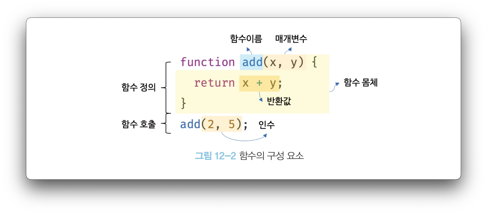

# 함수

1. 함수란
    1. 정의
        1. 함수는 일력의 과정을 문으로 구현하고 코드 블록으로 감사서 하나의 실행 단위로 정의한 것



1. 함수를 사용하는 이유
    1. 코드의 재사용
        1. 유지보수
        2. 코드의 신뢰성
    2. 코드 가독성
2. 함수 리터럴
    1. 구성요소
        1. 함수이름
            1. 식별자
            2. 함수 몸체 내에서만 참조할 수 있는
            3. 생략할 수 있다, 이름이 있는 함수를 기명, 이름이 없는 함수를 무명/익명 함수
        2. 매개변수 목록
            1. 0개 이상의 매개변수를 소괄호로 감싸고 쉼표 구분
            2. 순서대로 할당
            3. 몸체내에서 변수와 동일하게 취금
        3. 함수 몸체
            1. 함수가 호출되었을 때 하나의 실행 단위
            2. 함수 호출에 의해 실행
    2. 함수는 객체
        1. 일반 객체는 호출할 수 없지만 함수는 호출 가능
        2. 함수와 일급 객체는 18장에서 자세히
3. 함수 정의
    1. 함수 선언문

        ```jsx
        function add(x, y) {
          return x + y;
        }
        ```

        1. 함수 이름을 생략할 수 없다
        2. 표현식이 아닌 문
        3. 자바스크립트 엔진은 생성된 함수를 호출하기 위해 함수 이름과 동일한 이름의 식별자를 암묵적으로 생성하고 거기에 함수 객체를 할당
            1. 함수 호출은 함수 객체를 가리키는 식별자로 호출
    2. 함수 표현식

        ```jsx
        var sff = function () {
          ...
        }
        ```

        1. 변수에 할당이 가능
        2. 프로퍼티 값
        3. 배열의 요소
        4. 이러한 성질을 갖는 객체를 일급 객체
        5. 함수는 일급 객체
    3. 함수 생성 시점과 함수 호이스팅
        1. 함수 선언문은 선언문 이전에 호출 가능
        2. 함수 표현식은 불가능, 생성 시점이 다름
            1. 이 부분을 함수 이스팅이라 함
        3. 함수 표현식으로 함수를 정의하면 함수 호이스팅이 발생하는 것이 아니라 변수 호이스팅이 발생
            1. 더글라스 크락포드는 함수 표현식 사용을 권장
    4. Function 생성자 함수
        1. 클로저를 생성하지 않음
    5. 화살표 함수
        1. 항상 익명 함수
        2. 26.3 자세히
4. 함수 호출
    1. 매개변수와 인수
        1. 매개변수 스코프는 함수 내부, 13장 스코프에서 자세히
        2. 매개변수의 개수와 인수의 개수가 일치하지 않는지 체크하지 않음
    2. 인수 확인
        1. typeof
        2. 기본 값 할당
    3. 매개변수의 최대 개수
        1. 이상적인 함수는 한 가지 일만 해야 하며 가급적 작게 만들어야 함
    4. 반환문
        1. 실행 결과를 외부로 반환
        2. 없으면 undefined
5. 참조에 의한 전달과 외부 상태의 변경
    1. 원타 타입 인수는 값 자체가 복사되어 전달
    2. 객체 타입 인수는 참조를 복사 전달하기 때문에 객체를 변경 할 경우 원본이 변경
6. 다양한 함수 형태
    1. 즉시 실행 함수

        ```jsx
        (function () {
          .....
        }());
        ```

        1. 단 한번만 실행
        2. 익명함수가 일반적
        3. 변수, 함수 이름 충돌 방지 14.3자세히
    2. 재귀 함수
        1. 자기 자신 호출 함수
        2. 탈출 조건을 무조건 만들어야 함
    3. 중첩 함수
        1. 함수 내부에 정의된 함수
        2. 스코프, 클로저와 깊은 관련
    4. 콜백 함수
        1. 함수 매개변수를 통해 다름 함수로 전달되는 함수
        2. 매개 변수를 통해 함수 외부에서 콜백 함수를 전달받은 함수를 고차함수
            1. 29.7 자세히
            2. 콜백함수를 자신의 일부분으로 합성
        3. 고차 함수는 콜백 함수 호출 시점을 결정
    5. 순수 함수와 비순수 함수
        1. 부수 효과가 없는 함수를 순수 함수
            1. 언제나 동일한 값 반환
            2. 외부 상태에 의존하지 않으며 외부 상태를 변경하지 않음
        2. 비순수 함수
            1. 외부 상태를 변경하면서 사이드 이팩트 발생
            2. 상태 변화를 추적하기 어려움
            3. 순수 함수를 지양
            4. 함수형 프로그래밍은 순수 함수를 지향(불변성 지향)
