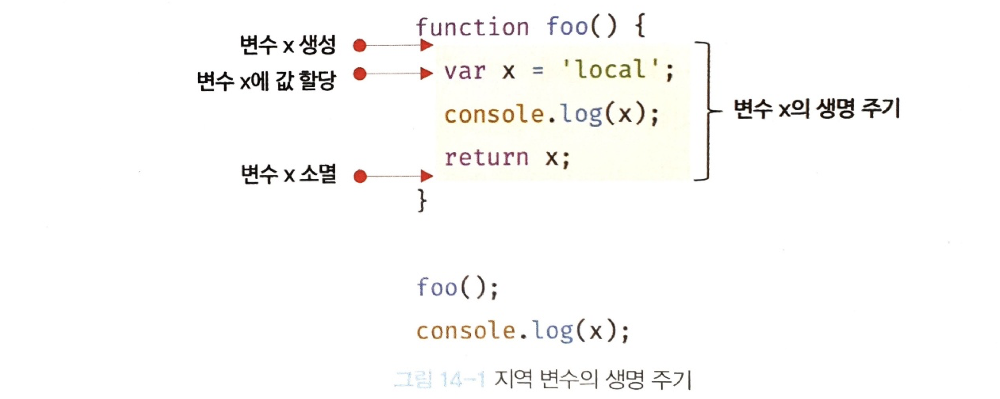

# 14장 전역 변수의 문제점

## 14.1 변수의 생명 주기

- 변수는 선언에 의해 생성되고, 할당을 통해 값을 가지며, 언젠가는 소멸되는 생명주기가 있다.
- 변수는 자신이 선언된 위치에서 생성되고 소멸한다.

1. 전역변수의 생명 주기는 애플리케이션 생명주기와 같다.
2. 함수 내부에서 선언된 지역 변수는 함수가 호출되면 생성되고 함수가 종료하면 소멸한다. (함수의 생명주기와 같다.)



- 호이스팅은 스코프를 단위로 동작한다.
- 아래 예제에서 ①이 undefined가 나온 이유?  
  => 지역변수 x가 이미 선언되었고, undefined로 초기화 되어 있기 때문. (전역 변수 x를 참조하는 것이 아니라 지역변수 x를 참조해 값을 출력한다.)

```
var x = 'global';

function foo() {
    console.log(x);  // ① undefined
    var x = 'local';
}

foo();
console.log(x);  // global
```

- var 키워드로 선언한 전역변수의 생명 주기는 전역 객체의 생명 주기와 일치한다.
- 브라우저 환경에서 전역 객체는 window 이므로 브라우저 환경에서 var 키워드로 선언한 전역 변수는 전역 객체 window의 프로퍼티다. 즉, 웹페이지를 닫을 때까지 유효하다.

<br />

## 14.2 전역 변수의 문제점

### 1. 암묵적 결합

- 전역 변수는 모든 코드가 전역 변수를 참조하고 변경할 수 있는 암묵적 결합을 허용한다. 이는 변수의 유효범위가 크면 클수록 코드의 가독성은 나빠지고 의도치 않게 상태가 변경될 수 있는 위험성도 높아진다.

### 2. 긴 생명 주기

- 전역변수는 생명 주기가 길다. 따라서 메모리 리소스도 오랜 기간 소비한다.

### 3. 스코프 체인 상에서 종점에 존재

- 변수를 검색할 때 전역 변수가 가장 마지막에 검색된다. 전역 변수의 검색 속도가 가장 느리다.

### 4. 네임스페이스 오염

- 자바스크립트의 가장 큰 문제점 중 하나는 파일이 분리되어 있다 해도 하나의 전역 스코프를 공유한다는 것이다. 따라서 다른 파일 내에서 동일한 이름으로 명명된 전역 변수나 전역 함수가 같은 스코프 내에 존재할 경우 예상치 못한 결과를 가져올 수 있다.

<br />

## 14.1 전역 변수의 사용을 억제하는 방법

- 전역 변수를 반드시 사용해야 할 이유를 찾지 못한다면 `지역 변수를 사용해야 한다.` `변수의 스코프는 좁을수록 좋다.`

### 1. 즉시 실행 함수

- 함수 정의와 동시에 호출되는 즉시 실행 함수는 단 한번만 호출된다.
- 모든 코드를 즉시 실행 함수로 감싸면 모든 변수는 즉시 실행 함수의 지역 변수가 된다.

```
(function() {
    var foo = 10;
    // ...
}());

console.log(foo);  // ReferenceError: foo is not defined
```

### 2. 네임스페이스 객체

- 전역에 네임스페이스 역할을 담당할 객체를 생성하고 전역 변수처럼 사용하고 싶은 변수를 프로퍼티로 추가하는 방법이다.
- 네임스페이스 객체 자체가 전역 변수에 할당되므로 그다지 유용해 보이지는 않는다.

```
var MYAPP = {};  // 전역 네임스페이스 객체
MYAOO.name = 'Lee';

console.log(MYAPP.name);  // Lee
```

### 3. 모듈 패턴

- 클래스를 모방하여, 관련이 있는 변수와 함수를 모아 즉시 실행 함수로 감싸 하나의 모듈을 만드는 방법이다.
- 모듈 패턴을 이해하려면 클로저를 먼저 이해해야 한다. (24장)

```
var Counter = (function () {
  // private 변수
  var num = 0;

  // 외부로 공개할 데이터나 메서드 프로퍼티를 추가한 객체를 반환
  return {
    increase() {
      return ++num;
    },
    decrease() {
      return --num;
    },
  };
})();

//private 변수는 외부로 노출되지 X
console.log(Counter.num); // undefined

console.log(Counter.increase()); // 1
console.log(Counter.increase()); // 2
console.log(Counter.decrease()); // 1
console.log(Counter.decrease()); // 0
```

- 위 예제의 즉시실행함수는 객체를 반환한다. 이 객체에는 외부에 노출하고 싶은 변수나 함수를 담아 반환한다. 이 때 반환되는 객체의 프로퍼티는 외부에 노출되는 퍼블릭 멤버다.
- 외부로 노출하고 싶지 않은 변수나 함수는 반환하는 객체에 추가하지 않으면 외부에서 접근할 수 없는 프라이빗 멤버가 된다.

### 4. ES6 모듈

- ES모듈은 파일 자체의 독자적인 모듈 스코프를 제공한다.
- 모듈 내에서 var 키워드로 선언한 변수는 더는 전역 변수가 아니며 window 객체의 프로퍼티도 아니다.
- 모던 브라우저에서는 ES6 모듈을 사용할 수 있다.

```
<script type="module" src="lib.mjs"></script>
<script type="module" src="app.mjs"></script>
```
